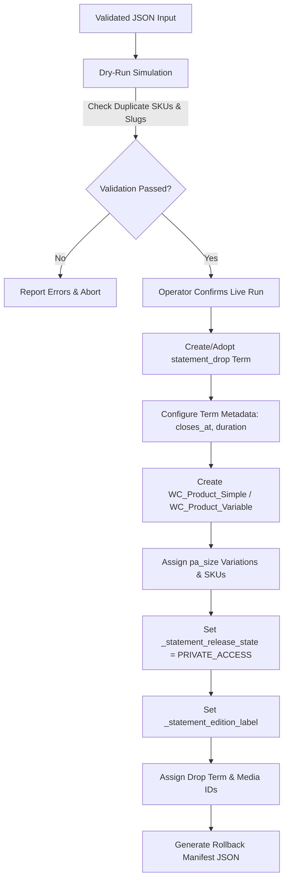

# Statement — Production Product Importer Architecture & Specification

## 1. Architectural Principles

The production importer is an administrator-only, standalone one-time tool decoupled from the temporary QA Fixtures plugin. It is designed with the following mandatory safety invariants:

1. **Dry-Run First**: Supports `--dry-run` execution mode that parses, validates, and simulates term/product/variation creation without writing database records.
2. **Strict Idempotency**: Inspects existing `statement_drop` terms and WooCommerce product SKUs before insertion. Re-running the tool on an existing Drop updates metadata without duplicating products or resetting inventory.
3. **Rollback Manifest Generation**: Produces a JSON manifest recording all created term IDs, product IDs, and variation IDs.
4. **Scarcity Invariant Protection**: Rejects any input containing public edition caps, lifetime volume counts, or restock notices.
5. **Initial State Integrity**: Products default to `_statement_release_state = 'PRIVATE_ACCESS'` (or `UPCOMING`), ensuring zero accidental public catalog leakage upon creation.

---

## 2. Import Workflow



---

## 3. Importer Execution Command Reference

```bash
# Dry-run validation mode (simulates import, writes 0 database records)
wp statement import-drop config/drop-001.json --dry-run

# Live execution mode (creates Drop, products, variations, outputs manifest)
wp statement import-drop config/drop-001.json --manifest=reports/drop-001-manifest.json
```
